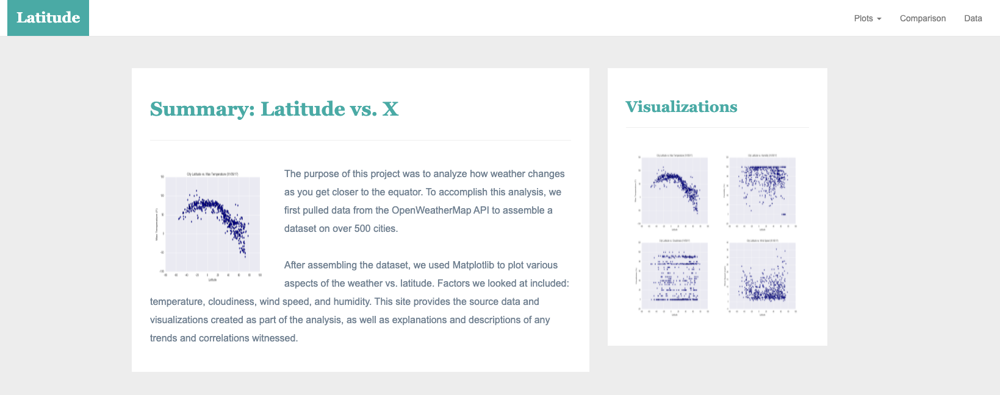

# Weather Analysis: Visualization Dashboard

**Data:** See 'Resources' folder of this repository.

**Analysis:** [City Weather Analysis](#)

## **OBJECTIVE**

Previously, I've run an analysis on a global city weather dataset, wherein the results of the analysis were shown graphically. For this project, I created a dashboard/website which will serve as:
(1) repository of all the charts/graphs generated from the previous analytics project; and
(2) a dashboard where the results and insights can be viewed.

In building this dashboard, I've created individual pages for each plot and a means by which viwers can navigate between them. Each page contains the visualizations and their corresponding explanations. There is also a landing page, where a comparison of all of the plots is shown, and another page where the data used to build them can be viewed.

In summary, the website consists of the following pages:
(1) Landing page - contains an explanation of the project and links to each page for each visualization. There is a sidebar containing preview images of each plot, and clicking an image takes the user to that visualization.

(2) Visualization pages - there will be a total of four (4).

(3) "Comparisons" page - contains all of the visualizations on the same page so we can easily visually compare them.

(4) "Data" page - displays a responsive table containing the data used in the visualizations.

## **OUTPUT**

Link to <a href="https://maylacdao.github.io/website-visualization-dashboard/" target="_blank">Dashboard</a>

**Landing Page**

**Navigation Bar**

**Charts**

## **CONTACT**

Email: [may.lacdao@gmail.com]

Linkedin: [Connect with me!](https://www.linkedin.com/in/maylacdao/)
